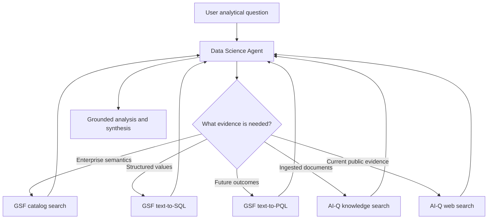

<!--
SPDX-FileCopyrightText: Copyright (c) 2026, NVIDIA CORPORATION & AFFILIATES. All rights reserved.
SPDX-License-Identifier: Apache-2.0
-->

# Data Science Agent

The Data Science Agent is an adaptive ReAct controller for questions that need
enterprise structured data, document evidence, public web evidence, or a
combination of those sources. It owns discovery, tool selection, analysis, and
final synthesis in one continuous message history.

**Location:** `src/aiq_agent/agents/data_science/`

The agent is exposed through two boundaries that share the same ReAct runtime:

- `data_science_workflow` starts it directly for local development and
  evaluation, without invoking the top-level router.
- `data_science_hybrid_adapter` accepts the catalog-aware Chat Researcher state
  when a product workflow selects Hybrid research.

## Tool integration

The agent receives tools through NeMo Agent Toolkit references and the
`data_source_registry`; it does not contain provider clients.

- `gsf__catalog_search` discovers query-relevant ontology candidates and entity
  coverage.
- `gsf__text_to_sql` generates validated SQL and returns bounded rows from GSF.
- `gsf__text_to_pql` sends forecast and future-outcome questions through GSF's
  Kumo/PQL prediction branch and returns generated PQL, bounded prediction rows,
  and available diagnostics.
- `knowledge_search` uses the configured AI-Q knowledge backend.
- `web_search_tool` uses the configured AI-Q web-search provider.
- `python`, when configured through `stateful_python`, provides one persistent
  scientific Python kernel per request. It is also a non-citable utility.

An empty `tools` list inherits every registry tool. A non-empty list is an
explicit override, and `exclude_tools` can remove exact runtime tool names.
Per-request `data_sources` filtering uses the same registry mapping as the
shallow and deep researchers.

## Runtime flow



GSF calls are made sequentially so each later question can use exact entities or
values observed earlier. Document and web searches should be narrow enough to
represent distinct evidence needs. The final answer goes through AI-Q's source
registry, citation verification, and report sanitization.

The optional request-local GSF guard enforces configured catalog, text-to-SQL,
and text-to-PQL call limits, serializes calls, caches exact repeats, and records
compact evidence diagnostics (coverage/candidate counts or row counts and
truncation). The agent prompt complements that boundary with an evidence ledger,
one broad catalog-discovery pass, consolidated analytical or predictive
requests, and bounded repair rules. Limits are opt-in so the general direct
profile remains tunable.

For analyses that require pandas, NumPy, SciPy, scikit-learn, or statsmodels,
the `stateful_python` NAT function keeps a real Python subprocess alive for the
entire DS request. The runtime creates and closes the process; the model sees a
single `python(code)` tool and does not manage workspace identifiers. Every
successful GSF text-to-SQL or text-to-PQL response containing rows is persisted
under a stable request-local reference (`gsf_1`, `gsf_2`, and so on). The kernel exposes
`list_gsf_results()`, `gsf_result(ref)`, `gsf_rows(ref)`, `gsf_sql(ref)`, and
`gsf_latest()`, so analysis consumes exact rows rather than copying values from
the conversation. The kernel has no configured source-database or GSF client;
all retrieval remains an agent-level GSF operation.

The DS runtime also reserves a final model call before the LangGraph recursion
boundary. When that reserve begins, tools are removed and the model must
synthesize from collected evidence. In `fdabench_choice` mode, a missing or
malformed leading `Answer:` line receives one no-tool format-repair call.

## Direct local run

Copy `deploy/.env.example` to `deploy/.env` and set:

- `INFERENCE_NVIDIA_API_KEY`
- `AIQ_INFERENCE_BASE_URL`
- `TAVILY_API_KEY`
- `GSF_BASE_URL`
- `GSF_EMAIL`
- `GSF_PASSWORD`
- `RAG_SERVER_URL`
- `COLLECTION_NAME`

Optional variables include `GSF_READ_TIMEOUT_SECONDS`,
`RAG_RETRIEVAL_TIMEOUT_SECONDS`, `RAG_VERIFY_SSL`, and
`AIQ_DS_INTERACTION_MODE`. Then run:

```bash
./scripts/start_cli.sh --config_file configs/config_cli_data_science.yml
```

The local profile uses password-session authentication for GSF. Product
integration should omit that auth block and rely on AI-Q's request-scoped user
token forwarding.

The direct CLI profile uses the Foundational RAG backend for knowledge
retrieval. Its ingestion URL is intentionally fail-closed because this profile
only searches an existing collection. TLS verification remains enabled by
default; trusted test routes using a self-signed chain can set
`RAG_VERIFY_SSL=false` locally.

## Predictive browser run

`configs/config_web_data_science_prediction.yml` exposes the direct Data Science
Agent through the local browser UI and enables `catalog_search`, `text_to_sql`,
and `text_to_pql`. It requires `NVIDIA_INFERENCE_API_KEY`, `TAVILY_API_KEY`,
`GSF_BASE_URL`, `GSF_EMAIL`, and `GSF_PASSWORD` in the process environment.

Start the backend and UI together:

```bash
./scripts/start_e2e.sh \
  --config_file configs/config_web_data_science_prediction.yml
```

The UI is available at `http://localhost:3000` and the backend at
`http://localhost:8000`. Kumo is executed by GSF: the remote GSF deployment must
have `KUMO_RFM_API_URL` configured and a predictive graph available for the
question's data. Setting `KUMO_RFM_API_URL` only in the AI-Q process does not
enable a remote GSF server.

For a forecast request, the prompt directs the agent to use text-to-PQL for the
future estimate and text-to-SQL only for explicitly requested historical
baselines or validation. A result without generated PQL is treated as a
diagnostic failure rather than prediction evidence.

This profile also sets `visualization_mode: native`. The final Markdown can
therefore include fenced `chart` and `chart-carousel` JSON blocks, which the
existing web UI renders as interactive SVG charts with accessible values and
CSV export. No image files or artifact storage are involved. Other profiles
default to `visualization_mode: none`, so benchmark and CLI output contracts do
not change unless explicitly enabled.

The chart contract keeps evidence types separate:

- PQL prediction scores, probabilities, risks, or future-outcome estimates are
  labeled as predicted and include their horizon.
- SQL time series are labeled as observed historical data and retain their
  actual grain, units, and as-of date.
- Predicted and observed series share a chart only when population, grain, and
  units align. Otherwise the report uses separate charts.
- Charts contain exact tool-derived or calculated values only. They do not add
  interpolated dates, projected points, or padded categories, and a report is
  limited to three charts.

An FDABench-style mixed-source prediction question for the `regional_sales`
database is:

> Using enterprise data through the latest available transaction date,
> identify the five customers most likely to place at least one order in the
> next 30 days. For each customer, report the Kumo prediction score. Then use
> observed historical data to report order count and total spend over the
> preceding 90 days, compare the predicted cohort's averages with all active
> customers, and use current public indicators of regional consumer demand as
> external context. Clearly separate predicted outputs from observed metrics,
> state the forecast horizon and as-of date, and disclose PQL, SQL, uncertainty,
> and material limitations.

## Product Hybrid integration

The context-aware Chat Researcher router performs one bounded GSF catalog probe
before selecting Hybrid research. Configure the adapter as the workflow's
optional Hybrid function:

```yaml
functions:
  data_science_agent:
    _type: data_science_agent
    llm: data_science_llm

  data_science_hybrid_adapter:
    _type: data_science_hybrid_adapter
    agent: data_science_agent

workflow:
  _type: chat_deepresearcher_agent
  hybrid_research_agent: data_science_hybrid_adapter
```

The adapter maps the original conversation, selected data sources, user
context, validated database scope, catalog result, and catalog request ID into
the DS Agent state. The prompt presents that catalog result as preloaded
semantic routing context, so the agent does not repeat the same broad discovery
call. Catalog candidates remain non-evidentiary and are never treated as query
rows.

Direct evaluation does not use this adapter. FDABench tasks continue to enter
through `data_science_workflow` with no preloaded catalog context, leaving the
ReAct agent free to decompose a mixed-source task and formulate focused catalog
searches itself.

## Non-interactive evaluation

Set `AIQ_DS_INTERACTION_MODE=headless` for benchmark and batch execution. The
agent then uses semantic discovery to resolve ambiguity, discloses defensible
assumptions, and never waits for a user response. If the model still emits a
clarification request, the runtime performs one bounded synthesis retry; a
second clarification becomes a terminal non-interactive limitation.

## FDABench-Lite profiles

Two direct profiles isolate the planned ablation without involving the shallow
researcher or top-level router:

- `configs/config_cli_data_science_fdabench_lite.yml` runs DS ReAct with GSF,
  Foundational RAG, and Tavily.
- `configs/config_cli_data_science_fdabench_lite_python.yml` keeps the same
  model, source tools, GSF limits, and response contract, and adds only the
  persistent scientific Python kernel with exact GSF-result helpers.

Both profiles are headless and set `response_mode: fdabench_choice`. When a task
contains labeled choices, the prompt evaluates every option and emits an
`Answer:` line first while retaining rationale and sources below it. Report-style tasks
without choices still receive the standard analytical report. The benchmark
adapter must include the target database name and complete answer choices in the
user request.

Required benchmark variables are `INFERENCE_NVIDIA_API_KEY`,
`AIQ_INFERENCE_BASE_URL`, `GSF_BASE_URL`, `GSF_EMAIL`, `GSF_PASSWORD`,
`RAG_SERVER_URL`, `COLLECTION_NAME`, and `TAVILY_API_KEY`. Optional
`AIQ_DS_GSF_CATALOG_CALL_LIMIT` and `AIQ_DS_GSF_TEXT_TO_SQL_CALL_LIMIT`
override the profile defaults of two and six actual calls, respectively. Exact
request-local cache hits do not consume those budgets.
`AIQ_DS_PYTHON_CALL_LIMIT`, `AIQ_DS_PYTHON_TIMEOUT_SECONDS`, and
`AIQ_DS_FINALIZATION_MODEL_CALL_LIMIT` tune the persistent analysis and reserved
finalization turn.

These profiles configure the runtime surface only; they do not bundle FDABench
data, RAG documents, database files, endpoint URLs, or credentials.

## Current boundaries

- The context-aware router provides the Hybrid dispatch hook, but shipped
  profiles must explicitly configure `data_science_hybrid_adapter` to select
  this agent.
- The dedicated predictive browser profile enables `text_to_pql`; the CLI and
  FDABench profiles remain historical-analysis profiles and intentionally omit
  it.
- Atomic-question clarification is planned separately and is not part of the
  direct workflow.
- The ReAct message/tool trajectory is observable through NAT tracing. Benchmark
  DAG materialization is not part of the production agent contract.
